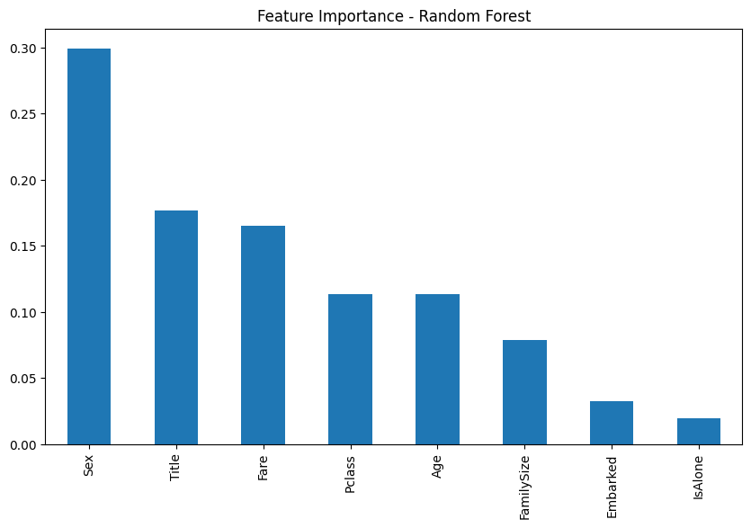
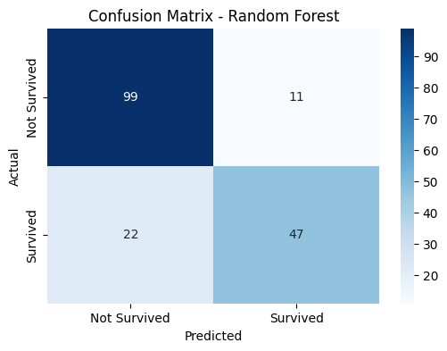

# 🚢 Titanic Survival Prediction Web App

This project is an end-to-end **machine learning classification solution** built on the Titanic dataset from Kaggle. It includes data preprocessing, feature engineering, model training using **Random Forest**, and finally an interactive **Streamlit web app** where users can enter values and get predictions on survival chances.

---

## 📌 Table of Contents

- [📖 Project Overview](#project-overview)
- [📊 Dataset Summary](#dataset-summary)
- [🛠️ Features Used](#features-used)
- [🧠 Model & Approach](#model--approach)
- [💻 Streamlit Web App](#streamlit-web-app)
- [📁 Project Structure](#project-structure)
- [🚀 How to Run Locally](#how-to-run-locally)
- [🌍 Live App (Optional)](#live-app-optional)
- [📚 Key Learnings](#key-learnings)
- [👤 Author](#author)

---

## 📖 Project Overview

The Titanic dataset is one of the most famous binary classification problems. The objective of this project is:

- To explore and analyze the Titanic dataset
- Build a robust ML pipeline using a Random Forest Classifier
- Scale relevant features using MinMaxScaler
- Deploy the final model via an interactive **Streamlit** web interface
- Let users input: `Age`, `Fare`, `Family Size`, `Pclass`, `Sex`, `Embarked`, `Title` and predict survival

---

## 📊 Dataset Summary

- **Source**: [Kaggle Titanic Dataset](https://www.kaggle.com/competitions/titanic/data)
- **Training Set**: 891 rows, 12+ features
- **Target**: `Survived` (0 = No, 1 = Yes)

---

## 🛠️ Features Used

The following features were used after preprocessing and feature engineering:

| Feature       | Description |
|---------------|-------------|
| `Pclass`      | Ticket class (1, 2, 3) |
| `Sex`         | Gender (0/1) |
| `Age`         | Normalized age |
| `Fare`        | Normalized fare |
| `Embarked`    | Port of embarkation (encoded) |
| `Title`       | Extracted from name (Mr, Miss, etc.) |
| `FamilySize`  | SibSp + Parch + 1 |
| `IsAlone`     | Binary: if travelling alone |

---

## 🧠 Model & Approach

- **Algorithm**: Random Forest Classifier  
- **Scaling**: MinMaxScaler  
- **Tuning**: RandomizedSearchCV for hyperparameter optimization  
- **Cross Validation**: 5-fold  
- **Metrics**:
  - Accuracy: ~81%

All trained models and scalers are saved using `joblib`.

---

## 📈 Important Features

The model is built using a Random Forest Classifier, which allows us to extract **feature importances** — i.e., how much each input variable contributes to survival prediction.

Below is the bar chart showing the most important features ranked by the model:

> 📌 **Insights**:
> - `Title` and `Sex` are the most influential features, indicating social status and gender played a major role in survival chances.
> - `Fare`, `Age`, and `Pclass` are also strong indicators.
> - `Embarked` and `IsAlone` have relatively less influence but still contribute to model accuracy.

---

## 📊 Confusion Matrix - Random Forest Classifier

The confusion matrix helps in evaluating the performance of the classification model by comparing predicted labels with actual labels.

> 📌 **Interpretation**:
> - **True Negatives (99)**: Correctly predicted "Not Survived"
> - **True Positives (47)**: Correctly predicted "Survived"
> - **False Negatives (22)**: Missed predictions — actually survived but predicted as not survived
> - **False Positives (11)**: Incorrectly predicted as survived when not

> ✅ The model performs well with a good balance between sensitivity (recall) and precision.

---

## ☁️ Deployment using Streamlit  

I deployed the model using Streamlit.

- I then made a simple frontend UI for deployment.
- I used Streamlit Cloud to deploy the final working model.

## 💻 Streamlit Web App

- **Source**: [Live project link](https://war-of-survival.streamlit.app/)

Users can interact with the model by entering the following:

- Age (slider)
- Fare (slider)
- Family Members (SibSp + Parch)
- Gender (dropdown)
- Pclass (dropdown)
- Title (dropdown)
- Embarked (dropdown)

Inputs are automatically **scaled using the saved MinMaxScaler**, passed to the trained model, and prediction is shown on-screen.

---

## Github Repository
[Repo link ](https://github.com/dev-nikhil02/War-of-Survival)
